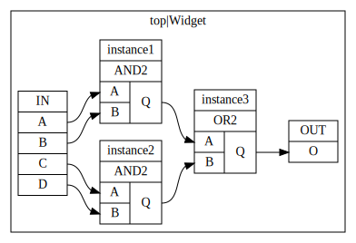

# EdifTests

These are a few tests using [SpyDrNet](https://github.com/byuccl/spydrnet) library.

## Minimal

`minimal.py` is a simple test program to implement the [example netlist](https://byuccl.github.io/spydrnet/docs/stable/reference/classes/index.html) from the SpyDrNet documentation.

```python minimal.py```

This will produce 'minimal.edf'.

### Edif2Dot

`edif2dot.py` will convert an edif netlist into a graphviz diagram. This will require both the graphviz [python bindings](https://pypi.org/project/graphviz/) and the [graphviz](https://www.graphviz.org/) runtime.

```python edif2dot.py minimal.edf```

This will produce `minimal.gv` and `minimal.gv.pdf`.

A few arguments are supported:
```
usage: edif2dot.py [-h] [--output OUTPUT] [--view] [--format FORMAT] netlist

Convert edif netlist into graphviz dot diagram

positional arguments:
  netlist          input netlist

optional arguments:
  -h, --help       show this help message and exit
  --output OUTPUT  output dot file
  --view           launch viewer
  --format FORMAT  output format
```

